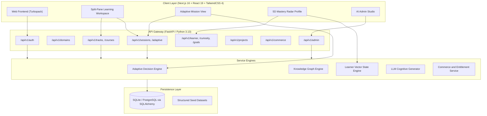
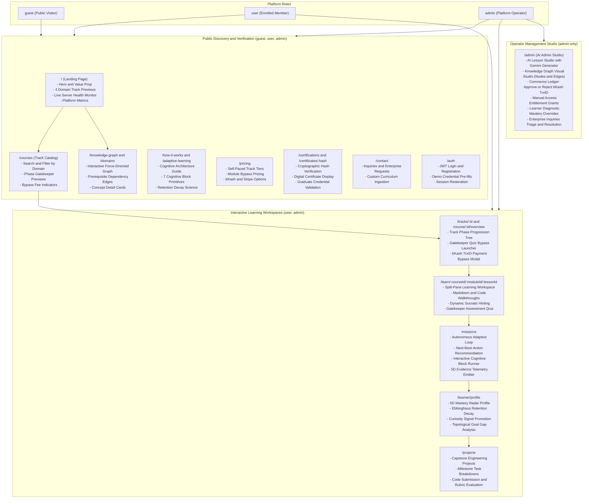

# PentaCourse — Adaptive Learning OS

A production-grade, multi-domain **Adaptive Learning Management Operating System** combining structured curriculum tracks with autonomous, knowledge-graph-driven cognitive exploration.

---
## System Architecture



---

## Standardized Role Architecture

The platform implements a clean 3-tier role taxonomy with unified permissions:

| Role | Access Level | Description & Core Privileges |
| :--- | :---: | :--- |
| **`guest`** | **Public** | Unauthenticated visitor. Can view public track catalogs, domain knowledge graphs, how-it-works, pricing, verify certificates, and submit contact inquiries. |
| **`user`** | **Authenticated Member** | Registered member. Can access everything a guest can, plus personalized split-pane learning workspaces, unlocked/paid modules, adaptive missions, gatekeeper quizzes, payment submissions, capstone engineering projects, and cognitive mastery profile tracking. |
| **`admin`** | **Operator / Whole Power** | Full platform control. Manages curriculum authoring, AI lesson generators, Knowledge Graph ontology curation, pricing, payment approvals/rejections, manual access grants, inquiries triage, and learner diagnostic overrides. |

---

## Use Case Diagram

```mermaid
flowchart LR
    subgraph Actors["Platform Actors"]
        G(("guest"))
        U(("user"))
        A(("admin"))
    end

    subgraph PublicDomain["Public Domain (guest Access)"]
        UC_Browse["Browse Track Catalog"]
        UC_KG_View["Explore Knowledge Graphs"]
        UC_VerifyCert["Verify Graduation Certificates"]
        UC_Inquiry["Submit Contact / Enterprise Inquiries"]
        UC_Auth["Register / Sign In JWT"]
    end

    subgraph MemberDomain["Member Domain (user Access)"]
        UC_Learn["Guided Split-Pane Learning Workspace"]
        UC_Gatekeeper["Take Gatekeeper Quizzes"]
        UC_PayBypass["Submit bKash / Stripe Module Bypass"]
        UC_Missions["Autonomous Adaptive Mission Loop"]
        UC_Evidence["Emit Multi-Dimensional Evidence"]
        UC_Radar["View 5D Mastery Radar & Retention Decay"]
        UC_Goals["Promote Curiosity Signals to Goals"]
        UC_Projects["Submit Capstone Engineering Projects"]
    end

    subgraph OperatorDomain["Operator Domain (admin Access)"]
        UC_AI_Author["AI Block-Based Lesson Authoring Studio"]
        UC_KG_Curate["Curate Graph Ontologies & Prereq Edges"]
        UC_ApprovePay["Approve / Reject bKash TrxID Payments"]
        UC_ManualGrant["Directly Grant Module Access"]
        UC_Overrides["Diagnostic Learner Mastery Overrides"]
        UC_TriageInq["Triage & Archive Enterprise Inquiries"]
        UC_Analytics["Inspect Platform Observability & Stats"]
    end

    G --> UC_Browse
    G --> UC_KG_View
    G --> UC_VerifyCert
    G --> UC_Inquiry
    G --> UC_Auth

    U --> UC_Browse
    U --> UC_Learn
    U --> UC_Gatekeeper
    U --> UC_PayBypass
    U --> UC_Missions
    U --> UC_Evidence
    U --> UC_Radar
    U --> UC_Goals
    U --> UC_Projects

    A --> UC_Browse
    A --> UC_Learn
    A --> UC_AI_Author
    A --> UC_KG_Curate
    A --> UC_ApprovePay
    A --> UC_ManualGrant
    A --> UC_Overrides
    A --> UC_TriageInq
    A --> UC_Analytics
```



---

## UI Page Map & Role Functionality Diagram

The following diagram maps the entire web application UI, showing how actors navigate between discovery, interactive learning workspaces, and the AI administrative studio:



### UI Page & Capability Matrix

| Route | Minimum Role | Key UI Features & Functional Components | Connected APIs |
| :--- | :---: | :--- | :--- |
| `/` | `guest` | Platform hero, 4 domain track teasers, 5-star student testimonials, live API health heartbeat monitor, quick-start CTA. | `GET /api/v1/courses`, `GET /health` |
| `/courses` | `guest` | Course track catalog with domain filtering, difficulty badges, phase gatekeeper icons, bypass fee pricing. | `GET /api/v1/courses` |
| `/domains` | `guest` | Knowledge domain explorer with concept counts, difficulty meters, and deep links to visual graphs. | `GET /api/v1/domains` |
| `/knowledge-graph` | `guest` | Full-screen interactive force-directed graph displaying concept nodes, prerequisite directional edges, and difficulty filters. | `GET /api/v1/domains/{id}/graph` |
| `/how-it-works` | `guest` | Visual documentation of the 3-step loop: Diagnostic Evaluation → Adaptive Remediation → Applied Capstone. | None (Static) |
| `/adaptive-learning` | `guest` | Detailed architectural deep dive into the 7 cognitive block primitives, Bayesian knowledge tracing, and spaced repetition decay. | None (Static) |
| `/pricing` | `guest` | Transparent pricing comparison (Free Tier, Single Track, All-Access Pass, Module Bypass Exam Fees). | `GET /api/v1/commerce/products` |
| `/certifications` | `guest` | Public certificate credential search and verification by certificate UUID or cryptographic hash. | `GET /api/v1/commerce/certificates/verify/{hash}` |
| `/contact` | `guest` | Enterprise curriculum inquiry form with category selector, validation, and submission confirmation. | `POST /api/v1/inquiries` |
| `/auth` | `guest` | Dual-mode tabbed Sign In / Sign Up modal with demo role fast-fill buttons (`Admin` and `Demo User`). | `POST /api/v1/auth/login`, `POST /api/v1/auth/register` |
| `/tracks/[courseId]` | `user` | Track syllabus tree, locked/unlocked phase badges, Gatekeeper exam bypass modal, bKash TrxID payment modal. | `GET /api/v1/tracks/courses/{id}/progress`, `POST /api/v1/tracks/modules/{id}/bypass-pay` |
| `/course/[courseId]/overview` | `user` | Executive syllabus view, learning outcomes, module list with interactive lesson launch triggers. | `GET /api/v1/courses/{id}` |
| `/learn/[courseId]/[moduleId]/[lessonId]` | `user` | Resizable split-pane workspace: lesson content/markdown on the left, interactive cognitive block, Socratic AI hint assistant, and Gatekeeper Quiz on the right. | `GET /api/v1/courses/{id}`, `POST /api/v1/tracks/modules/{id}/bypass-exam` |
| `/missions` | `user` | Adaptive Next-Best-Action mission runner, explainability cards ("Why this mission?"), active block sandbox, and evidence score submission. | `POST /api/v1/sessions/start`, `GET /api/v1/sessions/{id}/mission`, `POST /api/v1/sessions/{id}/evidence` |
| `/learner/profile` | `user` | Multi-dimensional 5D Mastery Radar chart, retention decay timeline, autonomous curiosity signal tracker, target learning goals, and topological gap diagnostic. | `GET /api/v1/learner/profile`, `GET /api/v1/curiosity/radar`, `GET /api/v1/goals` |
| `/projects` | `user` | Applied Capstone Engineering Project dashboard, step-by-step task instructions, code solution editor, and automated rubric grading. | `GET /api/v1/projects`, `POST /api/v1/projects/tasks/{id}/submit` |
| `/admin` | `admin` | Unified AI Admin Studio featuring 5 operational hubs: (1) AI Block Lesson Studio with Gemini, (2) Knowledge Graph Visual Studio, (3) Commerce bKash Approval Ledger, (4) Mastery Diagnostics Overrides, (5) Inquiries Triage. | `GET /api/v1/admin/*`, `POST /api/v1/admin/overrides/mastery`, `POST /api/v1/admin/commerce/payments/{id}/approve` |

---

## Entity-Relationship (ER) Diagram

```mermaid
erDiagram
    USERS ||--o{ DEVICE_SESSIONS : owns
    USERS ||--o| LEARNER_PROFILES : has
    USERS ||--o{ LEARNER_DOMAIN_STATES : tracks
    USERS ||--o{ LEARNER_CONCEPT_STATES : evaluates
    USERS ||--o{ GOALS : creates
    USERS ||--o{ EXPLORATION_ITEMS : discovers
    USERS ||--o{ LEARNING_SESSIONS : conducts
    USERS ||--o{ TRANSACTIONS : executes
    USERS ||--o{ ENTITLEMENTS : possesses
    USERS ||--o{ MODULE_BYPASSES : achieves
    USERS ||--o{ CERTIFICATES : earns
    USERS ||--o{ PROJECTS : builds

    DOMAINS ||--o{ CONCEPTS : contains
    DOMAINS ||--o{ SKILLS : contains
    DOMAINS ||--o{ LEARNING_SESSIONS : scopes
    DOMAINS ||--o{ COURSE_DOMAIN_MAPS : maps

    CONCEPTS ||--o{ CONCEPT_RELATIONS : connects
    CONCEPTS ||--o{ CONCEPT_SKILLS : joins
    CONCEPTS ||--o{ LEARNER_CONCEPT_STATES : evaluated_in
    CONCEPTS ||--o{ LESSON_CONCEPT_MAPS : referenced_by

    COURSES ||--o{ MODULES : structures
    MODULES ||--o{ LESSONS : sequences
    MODULES ||--o{ MODULE_BYPASSES : unlocks

    LEARNING_SESSIONS ||--o{ ATTEMPTS : records
    ACTIVITIES ||--o{ ATTEMPTS : targeted_by
    ATTEMPTS ||--o{ LEARNING_EVIDENCES : produces
    ATTEMPTS ||--o{ FAILURE_EVENTS : diagnoses

    PROJECTS ||--o{ PROJECT_TASKS : breaks_into

    USERS {
        string id PK
        string email UK
        string hashed_password
        string full_name
        string role "admin, user, or guest"
        boolean is_active
        datetime created_at
    }

    DOMAINS {
        string id PK
        string name
        string slug UK
        float difficulty
        boolean is_public
    }

    CONCEPTS {
        string id PK
        string domain_id FK
        string name
        string slug UK
        string type "FOUNDATION, THEORY, PRINCIPLE, TECHNIQUE"
        float difficulty
        float importance
    }

    CONCEPT_RELATIONS {
        string id PK
        string domain_id FK
        string from_concept_id FK
        string to_concept_id FK
        string relation_type "PREREQUISITE, EXPANDS, ANALOGY"
    }

    COURSES {
        string id PK
        string title
        string slug UK
        int price_in_cents
        string difficulty
        boolean is_published
    }

    MODULES {
        string id PK
        string course_id FK
        string title
        int order_index
        int bypass_fee_in_cents
    }

    LESSONS {
        string id PK
        string module_id FK
        string title
        int order_index
        json content_blocks
    }

    LEARNING_SESSIONS {
        string id PK
        string user_id FK
        string domain_id FK
        string status "ACTIVE, PAUSED, COMPLETED"
        datetime started_at
    }

    ATTEMPTS {
        string id PK
        string session_id FK
        string activity_id FK
        string user_id FK
        float score
        boolean is_correct
        json telemetry_json
    }

    LEARNING_EVIDENCES {
        string id PK
        string attempt_id FK
        string concept_id FK
        string dimension "RECALL, APPLICATION, CREATION"
        float score
    }

    TRANSACTIONS {
        string id PK
        string user_id FK
        string provider "BKASH, STRIPE"
        string transaction_ref UK
        int amount_in_cents
        string currency
        string status "PENDING, SUCCESS, FAILED"
        string item_type "COURSE, MODULE_BYPASS, CERTIFICATE"
        string item_id
    }

    ENTITLEMENTS {
        string id PK
        string user_id FK
        string item_type
        string item_id
        boolean is_active
    }

    INQUIRIES {
        string id PK
        string name
        string email
        string category
        string message
        string status "NEW, REVIEWED, ARCHIVED"
    }
```



---

## API Reference Directory (`/api/v1/*`)

All active endpoints are registered under `/api/v1` and protected with JWT Bearer authentication where applicable:

### 1. Authentication & Identity (`/api/v1/auth`)
| Method | Route | Minimum Role | Description |
| :--- | :--- | :---: | :--- |
| `POST` | `/api/v1/auth/register` | `guest` | Register new user account with default `USER` role. |
| `POST` | `/api/v1/auth/login` | `guest` | Authenticate email/password and receive Bearer JWT token. |
| `POST` | `/api/v1/auth/token` | `guest` | OAuth2 compatible token endpoint for Swagger docs. |
| `GET` | `/api/v1/auth/me` | `user` | Retrieve authenticated user profile, role, and active session info. |

### 2. Knowledge Domains & Graph Ontologies (`/api/v1/domains`)
| Method | Route | Minimum Role | Description |
| :--- | :--- | :---: | :--- |
| `GET` | `/api/v1/domains` | `guest` | List all public knowledge domains. |
| `GET` | `/api/v1/domains/{id}` | `guest` | Retrieve metadata for a single domain. |
| `GET` | `/api/v1/domains/{id}/graph` | `guest` | Full domain ontology: concepts, skills, and prerequisite relation edges. |

### 3. Curriculum, Tracks & Gatekeepers (`/api/v1/courses`, `/api/v1/tracks`)
| Method | Route | Minimum Role | Description |
| :--- | :--- | :---: | :--- |
| `GET` | `/api/v1/courses` | `guest` | List all published structured course tracks. |
| `GET` | `/api/v1/courses/{id}` | `guest` | Retrieve course syllabus, module sequence, and lessons. |
| `GET` | `/api/v1/tracks/courses` | `guest` | Track catalog with bypass exam flags. |
| `GET` | `/api/v1/tracks/courses/{id}/progress` | `user` | User's progress, phase completion, and mastery across course track. |
| `POST` | `/api/v1/tracks/modules/{id}/bypass-exam` | `user` | Submit Gatekeeper quiz responses to unlock next module phase. |
| `POST` | `/api/v1/tracks/modules/{id}/bypass-pay` | `user` | Submit payment confirmation to immediately bypass module. |

### 4. Adaptive Decision Engine & Sessions (`/api/v1/sessions`, `/api/v1/adaptive`)
| Method | Route | Minimum Role | Description |
| :--- | :--- | :---: | :--- |
| `POST` | `/api/v1/sessions/start` | `user` | Initialize an active learning session for a domain or goal. |
| `GET` | `/api/v1/sessions/{id}/mission` | `user` | Fetch Next-Best-Action recommendation with explainability factors. |
| `POST` | `/api/v1/sessions/{id}/evidence` | `user` | Ingest interactive cognitive block attempt telemetry & score. |
| `POST` | `/api/v1/sessions/{id}/complete` | `user` | Finalize learning session and compute session-level delta. |
| `GET` | `/api/v1/adaptive/recommendation/{domain_id}` | `user` | Direct query to the Adaptive Decision Engine matrix. |

### 5. Learner State, Goals & Curiosity (`/api/v1/learner`, `/api/v1/goals`, `/api/v1/curiosity`)
| Method | Route | Minimum Role | Description |
| :--- | :--- | :---: | :--- |
| `GET` | `/api/v1/learner/profile` | `user` | Get learner profile, challenge bias, and learning mode. |
| `GET` | `/api/v1/learner/domains/{id}` | `user` | Get multi-dimensional mastery scores for a domain. |
| `GET` | `/api/v1/learner/concepts/{id}` | `user` | Concept retention status and decay curve review date. |
| `GET` | `/api/v1/goals` | `user` | List user's active and completed target goals. |
| `POST` | `/api/v1/goals` | `user` | Create new learning goal with target concepts and level. |
| `GET` | `/api/v1/goals/{id}/gap-analysis` | `user` | Run topological gap analysis between user state and goal. |
| `POST` | `/api/v1/goals/{id}/diagnostic-probe` | `user` | Generate diagnostic assessment probe for goal concepts. |
| `GET` | `/api/v1/curiosity/radar` | `user` | List autonomous interest signals and exploration items. |
| `POST` | `/api/v1/curiosity/capture` | `user` | Record emergent curiosity signal from learning trajectory. |

### 6. Capstone Projects & Applied Creation (`/api/v1/projects`)
| Method | Route | Minimum Role | Description |
| :--- | :--- | :---: | :--- |
| `GET` | `/api/v1/projects` | `user` | List assigned capstone engineering projects. |
| `POST` | `/api/v1/projects` | `user` | Create user capstone project instance. |
| `GET` | `/api/v1/projects/{id}` | `user` | Get project tasks, descriptions, and rubrics. |
| `POST` | `/api/v1/projects/tasks/{id}/submit` | `user` | Submit implementation code and rationale for automated rubric grading. |

### 7. Commerce & Verification (`/api/v1/commerce`)
| Method | Route | Minimum Role | Description |
| :--- | :--- | :---: | :--- |
| `GET` | `/api/v1/commerce/products` | `guest` | Retrieve public pricing catalog and monetization products. |
| `POST` | `/api/v1/commerce/checkout` | `user` | Initiate a Stripe or bKash checkout session. |
| `POST` | `/api/v1/commerce/manual-payments` | `user` | Submit bKash Transaction ID (TrxID) for manual administrator verification. |
| `POST` | `/api/v1/commerce/webhooks/stripe` | `guest` | Stripe webhook receiver with cryptographic HMAC validation. |
| `POST` | `/api/v1/commerce/webhooks/bkash` | `guest` | bKash IPN / webhook receiver with signature validation. |
| `GET` | `/api/v1/commerce/certificates/verify/{hash}` | `guest` | Public cryptographic certificate verification endpoint. |

### 8. AI Cognitive Generator (`/api/v1/generator`)
| Method | Route | Minimum Role | Description |
| :--- | :--- | :---: | :--- |
| `POST` | `/api/v1/generator/activity` | `user` | Dynamically generate interactive cognitive blocks via Gemini. |
| `POST` | `/api/v1/generator/socratic-hint` | `user` | Generate targeted Socratic guidance based on diagnosed failure category. |

### 9. Offline Sync, Observability & Inquiries (`/api/v1/sync`, `/api/v1/telemetry`, `/api/v1/inquiries`)
| Method | Route | Minimum Role | Description |
| :--- | :--- | :---: | :--- |
| `POST` | `/api/v1/sync/push` | `user` | Ingest offline telemetry events recorded on mobile/desktop client. |
| `GET` | `/api/v1/sync/pull` | `user` | Pull authoritative server state delta since last timestamp. |
| `POST` | `/api/v1/telemetry/events` | `user` | Record client-side interaction events. |
| `GET` | `/api/v1/telemetry/summary` | `user` | Aggregated learner behavioral metrics. |
| `POST` | `/api/v1/inquiries` | `guest` | Submit contact inquiry or custom curriculum track request. |

### 10. Admin Control Panel (`/api/v1/admin/*`)
| Method | Route | Minimum Role | Description |
| :--- | :--- | :---: | :--- |
| `GET` | `/api/v1/admin/stats` | `admin` | Overall platform KPIs, learner counts, and transaction totals. |
| `POST` | `/api/v1/admin/domains` | `admin` | Create or update a Knowledge Domain in the ontology. |
| `POST` | `/api/v1/admin/concepts` | `admin` | Create or update a Concept node with difficulty & importance. |
| `POST` | `/api/v1/admin/relations` | `admin` | Create prerequisite relation edge between two concepts. |
| `POST` | `/api/v1/admin/overrides/mastery` | `admin` | Force override a learner's mastery vector score with audit reason. |
| `POST` | `/api/v1/admin/commerce/pricing` | `admin` | Update product pricing or bypass fee structures. |
| `POST` | `/api/v1/admin/lessons/generate` | `admin` | Prompt LLM cognitive generator to synthesize lesson blocks. |
| `POST` | `/api/v1/admin/lessons` | `admin` | Persist structured lesson blocks to module curriculum. |
| `GET` | `/api/v1/admin/inquiries` | `admin` | Search and filter submitted enterprise inquiries. |
| `PATCH`| `/api/v1/admin/inquiries/{id}` | `admin` | Update inquiry state (`NEW`, `REVIEWED`, `ARCHIVED`). |
| `DELETE`| `/api/v1/admin/inquiries/{id}`| `admin` | Delete inquiry record. |
| `GET` | `/api/v1/admin/commerce/payments`| `admin` | List pending and verified bKash payment submissions. |
| `POST` | `/api/v1/admin/commerce/payments/{id}/approve` | `admin` | Approve bKash payment and grant course/module entitlement. |
| `POST` | `/api/v1/admin/commerce/payments/{id}/reject` | `admin` | Reject unverified bKash transaction. |
| `POST` | `/api/v1/admin/commerce/grants` | `admin` | Direct manual entitlement grant to student email. |
| `DELETE`| `/api/v1/admin/commerce/payments/{id}` | `admin` | Delete transaction record from ledger. |

---

## Seed Demonstration Accounts

The database comes pre-seeded with 4 multi-domain knowledge ontologies (Medicine, Law, Finance, Python Systems), 5 complete structured curriculum tracks with interactive cognitive blocks & gatekeeper quizzes, and credentials:

| Role | Email | Password | Scope |
| :--- | :--- | :--- | :--- |
| **`admin`** | `admin@pentacourse.com` | `AdminMaster2026!` | Access to AI Admin Studio, Graph Studio, and payment approvals. |
| **`user`** | `demo@pentacourse.com` | `DemoStudent2026!` | Enrolled learner with active mastery vectors, missions, and capstones. |

---

## Getting Started

### 1. Prerequisites
- **Node.js**: 24.x or later
- **Python**: 3.12 or 3.13
- **Git**

### 2. Environment Setup
```bash
# Copy example environment configuration
cp .env.example .env
```

### 3. Backend Setup & Database Seeding
```bash
# Install Python dependencies
pip install -r backend/requirements.txt

# Run database migrations and seed all 4 multi-domain graphs and 5 curriculum tracks
python -m backend.app.seeds.seed_data

# Start FastAPI backend development server (port 8000)
uvicorn backend.app.main:app --reload --port 8000
```

### 4. Frontend Setup & Build
```bash
# Install Node dependencies
npm install

# Start Next.js development server (port 3000)
npm run dev

# Or build production bundle (Turbopack)
npm run build
npm run start
```

---

## License & Compliance

Proprietary © 2026 PentaCourse / Pentabrid Engine. All rights reserved.
