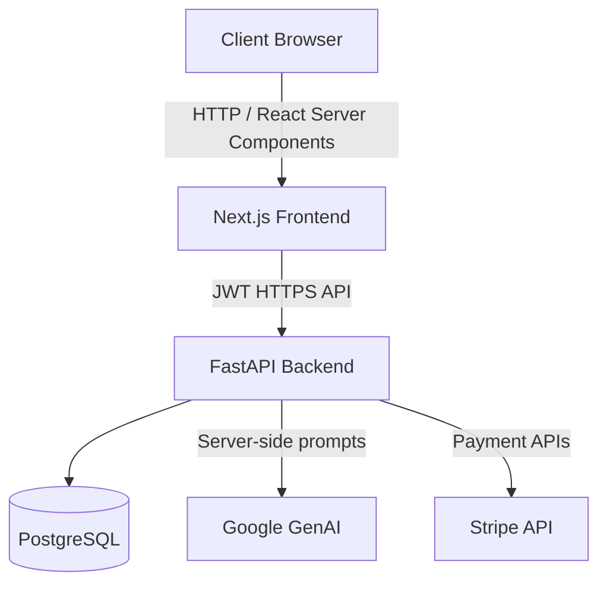
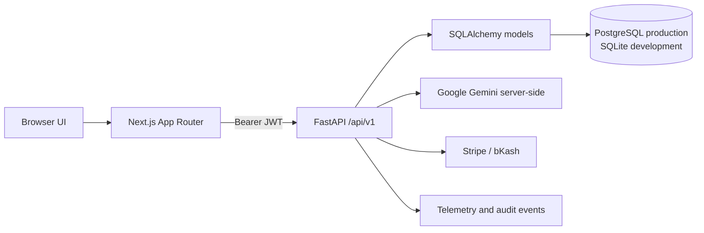

# Pentabrid Engine

Pentabrid Engine is a hybrid adaptive learning platform for structured course tracks and graph-driven learning missions. The web client is a Next.js application; authoritative identity, learning state, commerce, telemetry, and content data live behind a FastAPI API and relational database.

## Tech Stack
- **Frontend**: Next.js 16 (App Router), React 19
- **Backend API**: Python FastAPI, SQLAlchemy, Pydantic, Alembic
- **Styling & Animation**: TailwindCSS 4, Framer Motion
- **Database**: PostgreSQL in production, SQLite for local development
- **Authentication**: Backend-owned PBKDF2-SHA256 password hashes and signed JWTs
- **AI Integration**: Google GenAI (`@google/genai`)
- **Payments**: Stripe (Integrated via Transactions)

---

## System Architecture



---

## System Boundaries



---

## Use Case Diagram

```mermaid
usecaseDiagram
    actor Student
    actor Instructor
    actor Admin

    Student --> (Browse Courses)
    Student --> (Enroll in Course)
    Student --> (Take Lessons & Interactive Blocks)
    Student --> (Take Module Quizzes)
    Student --> (Bypass Module via Microtransaction)
    Student --> (Track Progress)

    Instructor --> (Create & Edit Courses)
    Instructor --> (Manage Modules & Lessons)
    Instructor --> (Publish Course)

    Admin --> (Manage Platform)
    Admin --> (View System Transactions)

    (Bypass Module via Microtransaction) .> (Process Stripe Payment) : include
    (Enroll in Course) .> (Process Stripe Payment) : include
```

---

## Getting Started

### Prerequisites
- Node.js 24.x
- Python 3.11+
- PostgreSQL for production or SQLite for local development

### Setup Instructions

1. **Install Dependencies**
   ```bash
   npm install
   ```

2. **Environment Configuration**
   Copy the `.env.example` file to `.env` and fill in your details:
   ```bash
   cp .env.example .env
   ```
    *Configure the backend `DATABASE_URL`, `SECRET_KEY`, `JWT_SECRET`, and provider keys as needed.*

3. **Backend Database Setup**
   ```bash
    cd backend
    python -m alembic upgrade head
    python -c "from backend.app.seeds.seed_data import seed_all; seed_all()"
   ```

4. **Run the Development Server**
   ```bash
   npm run dev
   ```
   Open [http://localhost:3000](http://localhost:3000) to view the application.

## Project Structure
- `src/app/` - Next.js routes and page-level experiences.
- `src/components/` - Navigation, learning, admin, marketing, and payment UI.
- `src/context/` - JWT auth and device-local UI state providers.
- `backend/app/api/v1/` - FastAPI route groups.
- `backend/app/models/` - SQLAlchemy persistence models.
- `backend/app/services/` - Adaptive, commerce, graph, telemetry, and AI services.
- `backend/alembic/` - Database migration history.
- `docs/` - Architecture, API, UI/UX, database, deployment, and operational references.

## Documentation Map

- [Architecture](docs/ARCHITECTURE.md) - runtime boundaries and data flows.
- [API Reference](docs/API_REFERENCE.md) - implemented route catalog and auth rules.
- [Database Design](docs/DATABASE.md) - tables, relationships, migrations, and state authority.
- [UI/UX Design](docs/UI_UX.md) - screens, navigation, interaction states, and responsive behavior.
- [Deployment](docs/DEPLOYMENT.md) - Vercel/API hosting, environment variables, and migration procedure.

## Current Scope

The authoritative backend path is implemented for authentication, roles, learning state, inquiries, commerce transactions, entitlements, admin authoring, telemetry, and adaptive learning. Theme preferences, hero presentation settings, and unsaved authoring drafts remain device-local by design. There is no Firebase or NextAuth dependency in the active application path.
