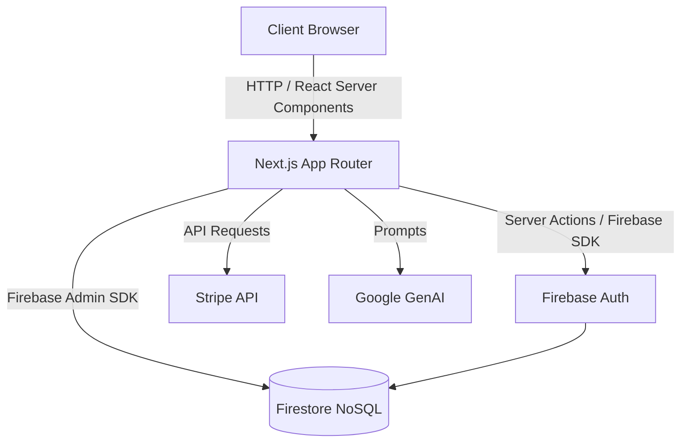
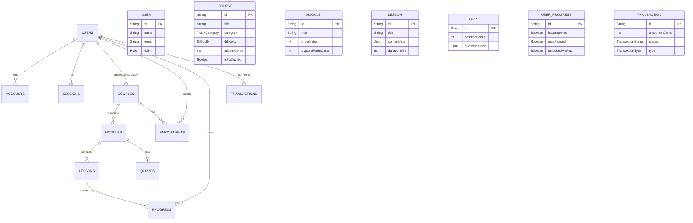

# Penta Course Platform

Penta Course is a modern, next-generation Learning Management System (LMS) built with Next.js, designed to provide interactive and engaging educational experiences. It supports rich content delivery including code steppers, terminal animations, and network diagrams, alongside traditional video and markdown content. 

The platform features a unique progression system with quizzes and an optional microtransaction model to bypass specific modules.

## Tech Stack
- **Frontend & Backend**: Next.js 16 (App Router), React 19
- **Styling & Animation**: TailwindCSS 4, Framer Motion
- **Database & Services**: Firebase (Firestore, Authentication, Functions/App Hosting)
- **AI Integration**: Google GenAI (`@google/genai`)
- **Payments**: Stripe (Integrated via Transactions)

---

## System Architecture



---

## Entity-Relationship (ER) Diagram (NoSQL Concept)

*Note: In Firestore, these will be represented as Root Collections and Subcollections.*



---

## Use Case Diagram

```mermaid
usecaseDiagram
    actor Student
    actor Instructor
    actor Admin

    Student --> (Browse Courses)
    Student --> (Enroll in Course)
    Student --> (Take Lessons & Interactive Blocks)
    Student --> (Take Module Quizzes)
    Student --> (Bypass Module via Microtransaction)
    Student --> (Track Progress)

    Instructor --> (Create & Edit Courses)
    Instructor --> (Manage Modules & Lessons)
    Instructor --> (Publish Course)

    Admin --> (Manage Platform)
    Admin --> (View System Transactions)

    (Bypass Module via Microtransaction) .> (Process Stripe Payment) : include
    (Enroll in Course) .> (Process Stripe Payment) : include
```

---

## Getting Started

### Prerequisites
- Node.js (v18+)
- MariaDB Server
- Stripe Account (for payment processing)

### Setup Instructions

1. **Install Dependencies**
   ```bash
   npm install
   ```

2. **Environment Configuration**
   Copy the `.env.example` file to `.env` and fill in your details:
   ```bash
   cp .env.example .env
   ```
   *Make sure to configure your `DATABASE_URL`, NextAuth secrets, and Stripe API keys.*

3. **Database Setup**
   Push the Prisma schema to your MariaDB instance:
   ```bash
   npx prisma db push
   ```
   *(Alternatively, use `npx prisma migrate dev` for migration history)*

4. **Run the Development Server**
   ```bash
   npm run dev
   ```
   Open [http://localhost:3000](http://localhost:3000) to view the application.

## Project Structure
- `src/` - Application source code (Next.js App Router).
- `prisma/` - Prisma ORM schema and configuration.
- `public/` - Static assets.
