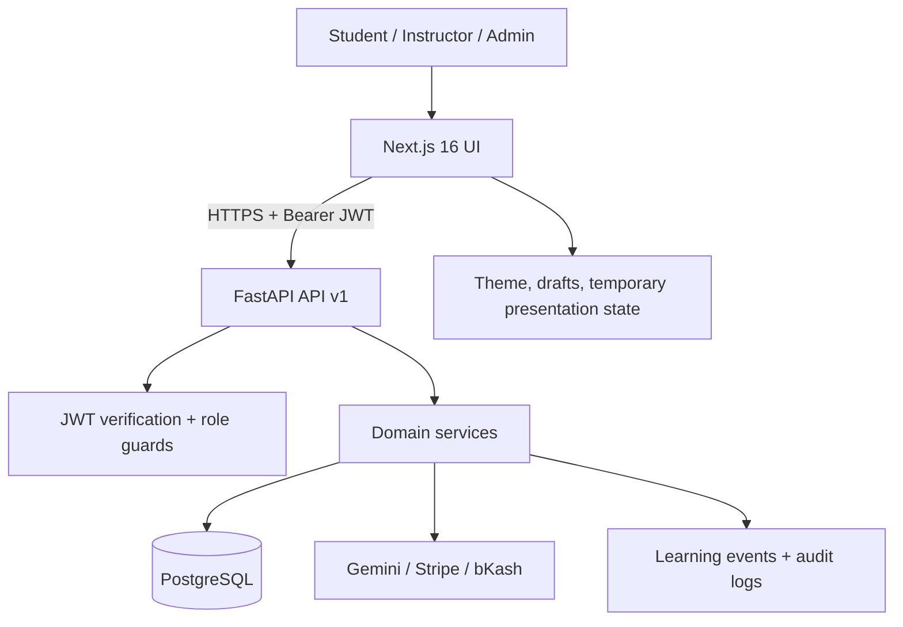
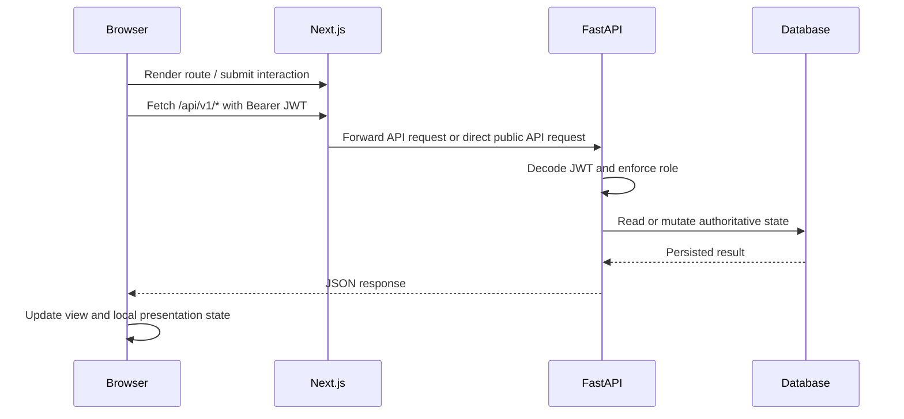
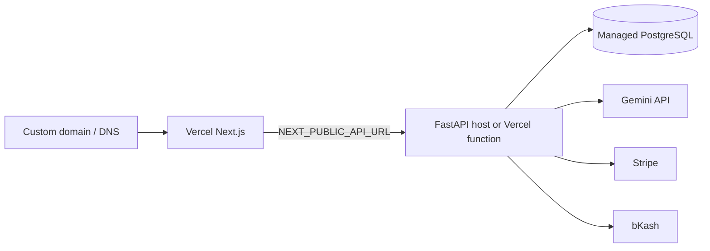

# Pentabrid Engine — System Architecture

## 0. Implementation Status

This document describes the current implementation, not a Firebase or Prisma proposal. The production authority is the FastAPI service and its relational database. Next.js owns presentation, routing, and browser interaction; it does not own account identity or authoritative learning state.



## 1. System Overview & Hybrid Paradigm
The **Unified Hybrid Adaptive Learning Platform** integrates two paradigms of learning into a single cognitive engine:
1. **Structured Guided Track**: Traditional hierarchical syllabus (`Course` $\to$ `Module` $\to$ `Lesson`) with prerequisite gating, fast-track Module Bypass Exams, and instant paid bypass unlock.
2. **Self-Directed Adaptive Mission**: Dynamic, personalized graph exploration where learners define high-level goals, and the engine computes topological frontier candidates, conducts diagnostic probes, detects misconceptions, and dynamically adapts difficulty.

Both modes are backed by the **same unified data model and cognitive engine**:
- Topological Knowledge DAGs (`NetworkX` DAG).
- 5-Dimensional Learner State Vectors ($\mathbf{v} = [R, E, A, I, C]$).
- Multimodal Learning Evidence Ledger.
- 10-Category Failure Taxonomy & Closed-Loop Repair.
- 7 Universal Cognitive Block Archetypes.
- Dual Payment Gateways (Stripe USD & bKash BDT) and Cryptographic Certificate Verification (SHA-256).

## 1A. Request and State Flow



---

## 2. 5-Dimensional Competence Model
Every learner-concept pair is quantified across 5 cognitive dimensions $\in [0.0, 1.0]$:

$$\text{Mastery}(c) = 0.15 \cdot R + 0.20 \cdot E + 0.30 \cdot A + 0.20 \cdot I + 0.15 \cdot C$$

Where:
- **$R$ (Recall)**: Immediate retrieval and term identification.
- **$E$ (Explanation)**: Conceptual understanding and causal articulation.
- **$A$ (Application)**: Diagnostic reasoning and problem solving under constraints.
- **$I$ (Implementation)**: Procedural execution, coding, calculation, and multi-step algorithmic derivation.
- **$C$ (Creation)**: Capstone synthesis, open-ended protocol design, and multi-constraint system building.

### Spaced Forgetting Curve (Ebbinghaus)
Retention decays exponentially over elapsed time:
$$R(t) = e^{-\lambda \cdot \Delta t}$$
where $\lambda = 0.05$ (adjusted by learner stability) and $\Delta t$ is days since last active interaction.

---

## 3. Deterministic 10-Factor Adaptive Scoring Formula
The `AdaptiveEngineService` computes a candidate score $S(c)$ for every concept $c$ on the learner's topological frontier:

$$S(c) = w_1 \cdot (1 - M_c) + w_2 \cdot G_c + w_3 \cdot P_c + w_4 \cdot (1 - R_c) + w_5 \cdot D_c + w_6 \cdot C_c + w_7 \cdot N_c + w_8 \cdot S_c + w_9 \cdot F_c + w_{10} \cdot E_c$$

1. **Weakness Gap** $(1 - M_c)$: Prioritizes concepts with lower mastery.
2. **Goal Relevance** $G_c$: Matches target concepts and ancestor paths of active goals.
3. **Prerequisite Value** $P_c$: Measures downstream unlocked node count in the DAG.
4. **Retention Urgency** $(1 - R_c)$: Prioritizes concepts with pending Ebbinghaus review dates.
5. **Difficulty Alignment** $D_c$: Proximity to learner's challenge preference ($ZPD$).
6. **Curiosity Bias** $C_c$: Boosts concepts marked in the learner's Exploration Radar.
7. **Novelty & Diversity** $N_c$: Avoids repetitive concept grinding.
8. **Session Continuity** $S_c$: Encourages thematic flow from recent interactions.
9. **Failure Repair Urgency** $F_c$: Prioritizes unmitigated prerequisite misconceptions.
10. **Evidence Scarcity** $E_c$: Promotes concepts lacking multidimensional observations.

---

## 4. 7 Universal Cognitive Block Archetypes
Instead of code-only widgets, the platform provides 7 domain-agnostic renderers:
1. `SequenceEngine`: Multi-step chronological or algorithmic execution (e.g., metabolic resuscitation algorithms, legal procedural analysis).
2. `CausalSystemGraph`: Interactive DAG perturbation sandbox (e.g., acid-base physiological shifts, central bank interest rate transmission).
3. `VariableSandbox`: Real-time multivariable mathematical parameter simulation (e.g., anion gap calculations, yield curve shifts).
4. `SpatialCanvas`: Visual spatial identification and structural mapping (e.g., anatomical cross-sections, patent schematic diagrams).
5. `ComparativeMatrix`: Multi-dimensional feature matrix contrasting paradigms (e.g., strict scrutiny vs rational basis, GIL vs multiprocessing).
6. `DialecticalBuilder`: Socratic argument and counter-argument synthesis (e.g., legal precedent analysis, economic policy debate).
7. `TaxonomySorter`: Hierarchical classification and entity categorization (e.g., disease classification, contract clause taxonomy).

---

## 5. Commerce, Monetization & Certificate Issuance
- **Dual Gateway Engine**:
  - **Stripe**: Credit card transactions in USD for international learners.
  - **bKash**: Mobile financial services in BDT for regional learners.
- **Monetizable Entitlements**:
  - Full Course Track purchases.
  - Instant Module Bypass unlocks (`/api/v1/commerce/checkout` or `/api/v1/commerce/manual-payments`).
  - Capstone project verification & Cryptographic Certificates.
- **Cryptographic Verification**:
  - Every certificate receives a tamper-proof SHA-256 signature calculated from `(certificate_id, user_id, course_id, issue_timestamp, secret_salt)`.
  - Publicly verifiable at `/api/v1/commerce/certificates/verify/{hash}` without authentication.


---

## 6. State Authority & Client Persistence

```
                     SERVER
                   PostgreSQL
                AUTHORITATIVE STATE LEDGER
                (Relational models, Evidence Ledger,
                 Audit Logs, Certificates)
                       ▲
                       │  HTTPS API / JWT
                       ▼
                  BROWSER CLIENT
                Presentation state and token cache
                (No authoritative business state)
```

### State Authority Principles
1. **Server Authoritative Store (PostgreSQL)**:
   - Contains the single source of truth for 5-D learner states, evidence ledger, transaction entitlements, certificates, and graph definitions.
   - Resolves merge conflicts deterministically using monotonic event sequence IDs and server-stamped timestamps.
2. **Local browser storage**:
  - Stores only non-authoritative UI preferences and temporary presentation settings.
  - JWT access tokens are stored under `penta_access_token` for the current web client session.
  - Inquiries, payments, grants, lessons, learner state, telemetry, and entitlements are persisted through FastAPI.

## 7. Deployment Topology



The frontend and API may share a Vercel project through `/api/v1` rewrites, or run as separate deployments. `NEXT_PUBLIC_API_URL` must be the API origin only, without `/api`; `CORS_ORIGINS` contains frontend origins.

## 8. Security Boundaries

- Registration always assigns `STUDENT`; clients cannot self-assign elevated roles.
- JWT signing uses `SECRET_KEY`; production must not use the development default.
- Administrative routes use backend role guards, not only hidden frontend controls.
- Passwords are stored as deterministic PBKDF2-SHA256 hashes salted from the server secret by the current implementation.
- Payment webhooks and transaction fulfillment are server-side and idempotent.
- AI generation can suggest content but does not directly mutate learner mastery.
