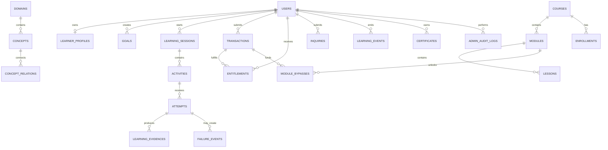
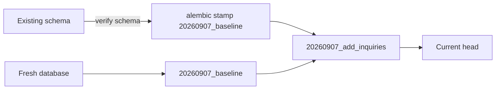

# Database Design

## Purpose

The database is the authoritative store for identity, learning state, content, commerce, telemetry, audit history, and contact inquiries. PostgreSQL is the production target; SQLite is supported for local development and migration validation.



## Table Groups

### Identity and access

- `users`: email, server-side password hash, role, active state, timestamps.
- `device_sessions`: future multi-device/session synchronization records.
- Roles are intentionally limited to `STUDENT` and `SUPER_ADMIN`.
- Public registration always creates `STUDENT`; only a trusted operator or seed process can create `SUPER_ADMIN`.

### Knowledge and course content

- `domains`, `concepts`, `skills`: knowledge taxonomy.
- `concept_relations`, `skill_relations`, `concept_skills`: graph and skill edges.
- `courses`, `modules`, `lessons`: structured track hierarchy.
- `resources`, `resource_concepts`, `lesson_concept_maps`: content-to-knowledge mappings.

### Learner state

- `learner_profiles`: learner mode and challenge preference.
- `learner_domain_states`, `learner_concept_states`, `learner_skill_states`: multidimensional mastery and retention state.
- `goals`, `exploration_items`: directed goals and curiosity radar.
- `learning_sessions`, `activities`, `attempts`: session execution.
- `learning_evidences`, `failure_events`, `recommendation_audits`: evidence, repair, and explainability.
- `learning_events`: append-oriented telemetry and synchronization events.

### Commerce and trust

- `products`: public catalog.
- `transactions`: payment attempts and provider references.
- `entitlements`: authoritative access grants.
- `enrollments`: course access.
- `module_bypasses`: paid or exam-earned module unlocks.
- `certificates`: public verification hashes.
- `admin_audit_logs`: administrative mutations.
- `inquiries`: persistent contact and enterprise requests.

## State Rules

1. A browser cannot grant itself an entitlement; the API creates it after an approved payment or admin action.
2. Public registration always creates a `STUDENT` user.
3. A transaction is the source record for payment state; `SUCCESS` fulfillment creates access records.
4. Learner mastery is derived from attempts and evidence, not from client-submitted role or local storage.
5. Inquiry status is server-owned: `NEW`, `REVIEWED`, or `ARCHIVED`.
6. Manual bKash transaction references are unique to prevent duplicate submissions.

## Migration Strategy



Run from `backend/`:

```bash
python -m alembic upgrade head
```

The baseline migration creates the existing SQLAlchemy metadata with `checkfirst=True`. The inquiry migration adds the `inquiries` table. For an existing database created outside Alembic, inspect it before stamping the baseline; never apply the baseline as if it were an empty database.

## Backup and Recovery

- Use managed PostgreSQL snapshots for production.
- Test `alembic upgrade head` against a fresh staging database before release.
- Keep provider webhooks idempotent and retain transaction references.
- Do not commit production database files or credentials.
