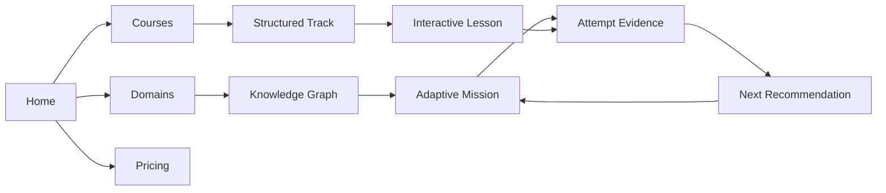
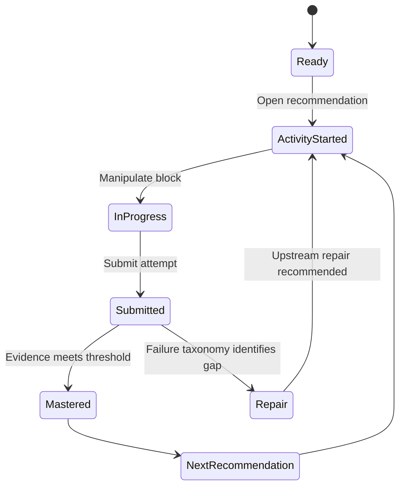

# UI/UX Design and Interaction Model

## Product Experience

Pentabrid Engine is a work-focused learning tool, not a marketing shell. The interface is organized around three recurring jobs:

1. Discover a domain or course.
2. Perform an active learning mission and produce evidence.
3. Review progress, repair gaps, or continue a structured track.

## Global Shell

The root layout owns the global shell:

- Fixed `NavigationBar` at 64px height.
- Content wrapper padded by `pt-16` so pages do not hide beneath the header.
- Responsive navigation drawer on small screens.
- Theme switcher and profile menu.
- Server health button polling the API every 60 seconds.
- Shared footer with pricing, contact, and external organization links.

### Server status states

| State | Meaning | Visual intent |
|---|---|---|
| Checking | Initial request or manual refresh in progress | Neutral gray, pulse |
| Server OK | API and database health response are healthy | Emerald green |
| Degraded | API answered but database health is not healthy | Amber |
| Offline | Request timed out or failed | Rose/red |

Clicking the status button performs an immediate health check. The production API URL is read from `NEXT_PUBLIC_API_URL`; local development uses the `/api/health` rewrite.

## Route and Screen Model

| Route | Primary user job |
|---|---|
| `/` | Understand the platform and enter a learning path |
| `/domains` | Compare knowledge domains |
| `/courses` | Browse structured tracks |
| `/missions` | Start adaptive learning |
| `/knowledge-graph` | Inspect prerequisite relationships |
| `/tracks/[courseId]` | Review track/module progression |
| `/learn/[courseId]/[moduleId]/[lessonId]` | Complete an interactive lesson |
| `/learner/profile` | Review learner state and evidence |
| `/auth` | Register or log in through backend JWT auth |
| `/admin` | Manage content, inquiries, commerce, and settings |
| `/pricing` | Compare products and access options |
| `/certifications` | Verify a certificate |

## Learning Interaction Loop

Every interactive block should expose a clear task, visible state, reversible interaction where possible, and a submission boundary. The backend receives the resulting attempt/evidence; the client does not directly alter mastery values.

## Cognitive Block Language

The platform uses reusable interaction primitives rather than domain-specific one-off screens:

- `SequenceEngine`: ordered steps and procedural execution.
- `CausalSystemGraph`: nodes, edges, perturbations, and propagation.
- `VariableSandbox`: adjustable parameters and computed outcomes.
- `SpatialCanvas`: visual structure and hotspot identification.
- `ComparativeMatrix`: side-by-side criteria and tradeoffs.
- `DialecticalBuilder`: claims, warrants, counterarguments, and synthesis.
- `TaxonomySorter`: classification and hierarchical grouping.

## Admin Experience

Admin screens are role-gated twice:

1. The UI hides or redirects unauthorized views.
2. FastAPI validates the bearer JWT and role on every mutation.

Admin workflows include:

- Knowledge domain and concept maintenance.
- Lesson generation and publishing.
- Inquiry triage: `NEW` to `REVIEWED` or `ARCHIVED`.
- bKash payment review: pending, approve, reject, and audit.
- Manual module entitlement grants.
- Pricing and gateway display settings.

## Responsive Rules

- Desktop navigation exposes route links and operational controls.
- Mobile navigation collapses route links into a drawer; status, theme, and profile controls remain reachable.
- Learning surfaces use stable dimensions for controls and tiles so labels do not shift layouts.
- Dense operational views prioritize scanning, filtering, and explicit status labels.
- Content pages use the global header and never render a second page-local header.

## Persistence UX Rules

Authoritative data is loaded and mutated through the API:

- Identity and session restoration: `/api/v1/auth/*`.
- Inquiries: `/api/v1/inquiries` and admin inquiry routes.
- Payments and entitlements: `/api/v1/commerce/*` and admin commerce routes.
- Learning state, sessions, evidence, and telemetry: `/api/v1/*` learning routes.

Local browser storage is reserved for presentation preferences, theme state, and temporary drafts. A local value must never be treated as proof of access, payment, role, or mastery.
